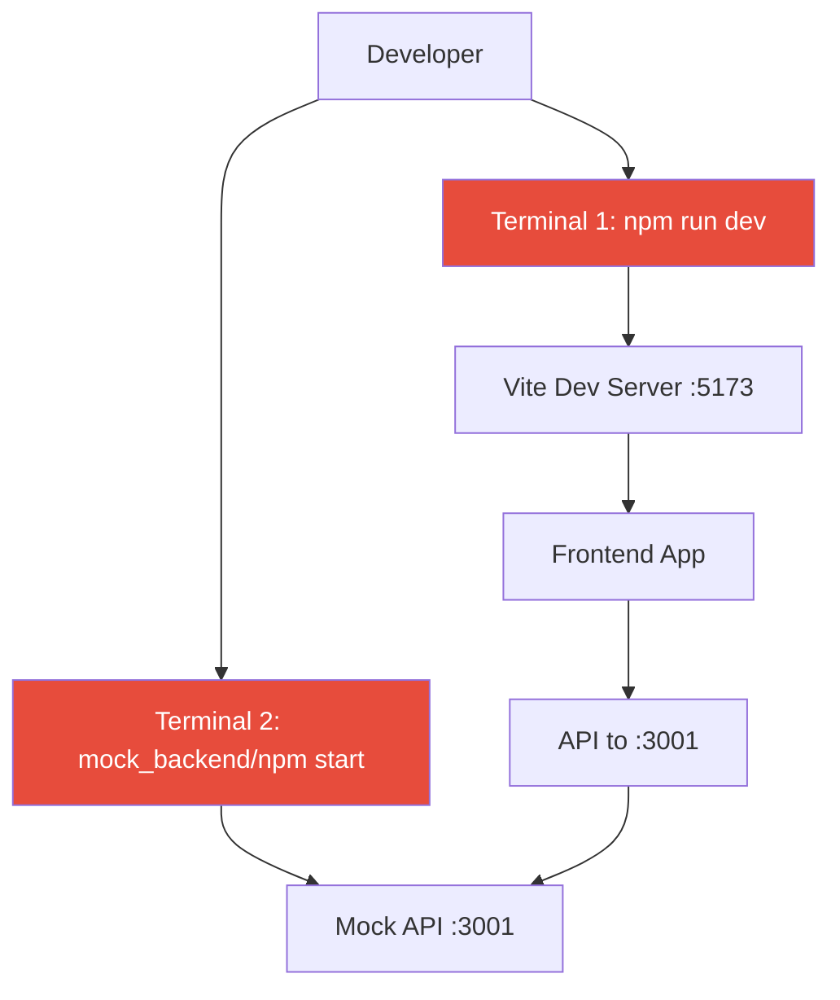

# Dev Workflow Optimization & Sidebar Fixes

## Overview

This design addresses two critical improvements to enhance developer experience and user interface quality:

**Task A**: Streamline the development workflow to enable single-command startup (`npm run dev`) by integrating the mock API directly into Vite middleware, eliminating the need for multiple terminal sessions.

**Task B**: Fix sidebar utilities duplication, implement proper hover/active states for router items, normalize utility controls to icon-only behavior, and remove the wordmark while maintaining consistent alignment and smooth animations.

**Allowed commands only:** `npm i`, `npm run dev`.
**No new packages.** Sidebar changes must not introduce dependencies. `package.json` changes are limited to scripts.

## Repository Type: Frontend Application (Vue 3)

Based on codebase analysis, this is a Vue 3 frontend application with:

* Vite as build tool
* A mock API used in development (currently separate or partially integrated)
* Component-based architecture with a custom sidebar
* Theme via CSS custom properties
* State via custom stores

## Architecture

### Current Development Architecture (problem)



### Target Development Architecture (solution)

```mermaid
graph TD
    A[Developer] --> B[npm run dev]
    B --> C[Vite Dev Server :5173]
    C --> D[Mock API Middleware (/api/*)]
    C --> E[Frontend App]
    E --> F[API Requests to /api/*]
    F --> D
    style B fill:#27ae60,color:white
    style C fill:#27ae60,color:white
```

### Sidebar Component Hierarchy

```mermaid
graph TD
    A[Sidebar.vue] --> B[SidebarBrand.vue]
    A --> C[SidebarSection: Navigation]
    A --> D[SidebarSection: Utilities]
    C --> E[SidebarItem × 4 (Chats, Agents, Knowledge, Account)]
    D --> F[SidebarUtility × 4 (Theme, Language, Light/Dark, Logout)]
    A --> G[Collapse Toggle (expanded only)]
    style A fill:#3498db,color:white
```

---

## Task A: Single-Command Development Workflow

### Goal

Run the entire dev stack (frontend + mock API) with **one command**: `npm run dev`.

### Solution

* Move mock API into **Vite middleware** (dev-only).
* Serve endpoints under `/api/*` on the same origin.
* Simplify `package.json` to a single `dev` script.

### `package.json` (scripts)

```json
{
  "name": "trickster",
  "private": true,
  "type": "module",
  "scripts": {
    "dev": "vite",
    "build": "vue-tsc -b && vite build",
    "preview": "vite preview --port 4173",
    "typecheck": "vue-tsc --noEmit"
  }
}
```

### Vite mock middleware (concept)

```js
// vite.config.(js|ts)
export default ({ command }) => ({
  plugins: [{
    name: 'mock-api',
    configureServer(server) {
      // dev-only
      server.middlewares.use('/api', (req, res, next) => {
        // route to existing handlers (refactored from mock server)
        // mockRouter(req, res, next)
        next()
      })
    }
  }]
})
```

### Acceptance (Task A)

* `npm run dev` starts frontend and mock API; **no second terminal**.
* API available under `/api/*`; no port conflicts.
* No new dependencies; production build unchanged.

---

## Task B: Sidebar Fixes & Improvements

### Problems to Fix

1. **Utilities duplication** (Theme/Language rendered twice).
2. **Light/Dark and Logout** not normalized to **icon-only**.
3. **Router hover/active** states missing correct geometry (pill/circle).
4. **Layout shifts** on hover due to DOM-based highlights.
5. **Wordmark (“Trickster”)** should be hidden for now (logo only).

### Geometry Tokens (CSS Custom Properties)

```css
.sidebar {
  --collapsed-width: 72px;
  --expanded-width: 256px;
  --icon-size: 24px;
  --icon-axis-x: calc(var(--collapsed-width) / 2);               /* 36px */
  --left-gutter: calc(var(--icon-axis-x) - var(--icon-size) / 2);/* 24px */
  --row-height: 48px;
  --row-radius: 12px;

  /* map these to existing theme tokens */
  --hover-bg: color-mix(in oklab, var(--accent) 14%, transparent);
  --active-bg: color-mix(in oklab, var(--accent) 20%, transparent);
  --focus-ring: color-mix(in oklab, var(--accent) 60%, transparent);
}
```

### Alignment System

* Every row uses a **two-track grid**: `[icon fixed 24px] + [label flexible]`.
* `padding-left: var(--left-gutter)`; icon stays on the **shared axis**.
* On collapse: **label track width → 0** (keep in DOM to animate); **icon track constant**.

### Work Items

#### 1) Remove duplicated utilities

* Render utilities from **one** array in **one** place; ensure unique keys.
* Final order: **Theme (palette) → Language (globe) → Light/Dark (sun/moon) → Logout (exit)** — each exactly **once**.

#### 2) Normalize utility controls (icon-only)

* **Theme**/**Language**: keep functionality; **no labels**; add `title` + `aria-label`.
* **Light/Dark**: **single icon toggle** (sun ↔ moon), no text; `title`/`aria-label` reflect state; reuse existing dark-mode state.
* **Logout**: icon-only; click triggers existing logout; `title` + `aria-label`.
* Utilities use **circular** hover/active geometry (same as collapsed items) and align to the axis.

#### 3) Router items — hover/active highlighting

* **Expanded:** **pill** background covering icon + label.
* **Collapsed:** **circle** centered on the icon.
* Implement hover/active/focus **as pseudo-elements** (`::before`/`::after`) so row size never changes.
* Active mirrors hover geometry (pill in expanded, circle in collapsed).

#### 4) Brand row (wordmark off)

* Hide the **“Trickster”** wordmark; keep **logo only**.
* **Collapsed:** logo click **expands** sidebar (no navigation).
* **Expanded:** logo click **navigates to Dashboard**.
* Hover: minimal micro-effect on logo only (no pill/circle background).

#### 5) Tooltips & ARIA

* Utilities (icon-only) require **`title`** and **`aria-label`**.
* Router items may add `title` **only when collapsed** (optional).
* Do not render visible DOM text like “Current theme: …” near utilities.

#### 6) Animations & fades

* Animate only **label width** and **opacity** on collapse/expand (\~180–220ms, `ease`).
* Apply **right-edge text fade only during collapse**:

  ```css
  .sidebar-label {
    transition: width 200ms ease, opacity 200ms ease;
    overflow: hidden; white-space: nowrap;
  }
  .sidebar--collapsing .sidebar-label {
    mask-image: linear-gradient(to right, black calc(100% - 16px), transparent 100%);
    -webkit-mask-image: linear-gradient(to right, black calc(100% - 16px), transparent 100%);
  }
  ```
* Focus rings match geometry (pill/circle) via pseudo-elements (avoid rectangular outlines).

### Hover/Active Implementation (no layout shift)

**Expanded (pill)**

```css
.sidebar:not(.collapsed) .sidebar-item { position: relative; }
.sidebar:not(.collapsed) .sidebar-item::before {
  content:""; position:absolute; inset:0;
  border-radius: var(--row-radius);
  background: var(--hover-bg); opacity:0; transition: opacity 200ms ease;
  pointer-events:none;
}
.sidebar:not(.collapsed) .sidebar-item:hover::before,
.sidebar:not(.collapsed) .sidebar-item[aria-current="page"]::before { opacity:1; }
```

**Collapsed & Utilities (circle)**

```css
.sidebar.collapsed .sidebar-item,
.sidebar-utility { position: relative; }
.sidebar.collapsed .sidebar-item::before,
.sidebar-utility::before {
  content:""; position:absolute; left: var(--icon-axis-x); top:50%;
  translate: -50% -50%; width: var(--row-height); height: var(--row-height);
  border-radius:50%; background: var(--hover-bg);
  opacity:0; transition: opacity 200ms ease; pointer-events:none;
}
.sidebar.collapsed .sidebar-item:hover::before,
.sidebar.collapsed .sidebar-item[aria-current="page"]::before,
.sidebar-utility:hover::before,
.sidebar-utility[aria-current="page"]::before { opacity:1; }
```

**Focus ring (shape-aware)**

```css
/* pill focus */
.sidebar:not(.collapsed) .sidebar-item:focus-visible::after {
  content:""; position:absolute; inset:0; border-radius: var(--row-radius);
  outline:2px solid var(--focus-ring); outline-offset:2px;
}
/* circle focus */
.sidebar.collapsed .sidebar-item:focus-visible::after,
.sidebar-utility:focus-visible::after {
  content:""; position:absolute; left: var(--icon-axis-x); top:50%;
  translate:-50% -50%; width: var(--row-height); height: var(--row-height);
  border-radius:50%; outline:2px solid var(--focus-ring); outline-offset:2px;
}
```

### Accessibility

* All interactive rows ≥ **44px** height.
* Utilities: `role="button"` (if not `<button>`), `aria-label`, `title`.
* Keyboard: Tab to focus; Enter/Space to activate; focus indicators visible.

---

## Testing Strategy

### Dev Workflow

* `npm i` → `npm run dev` starts Vite and mock middleware.
* API reachable at `/api/*`; no second process needed.

### Sidebar Behavior

* Utilities: **exactly 4** buttons, **no duplicates**, **icon-only**, tooltips/ARIA present.
* Light/Dark: single icon toggles state; no text nodes.
* Router items: pill (expanded) / circle (collapsed) hover+active; **no layout shift**.
* Brand: wordmark hidden; logo-only behavior per state.
* Alignment: all icons share the axis; no X shift on collapse/expand.

### Performance

* Hover/active via pseudo-elements (no reflow).
* Labels animate width/opacity only.
* Respect `prefers-reduced-motion`.

---

## Implementation Phases

**Phase 1 — Dev Workflow**

1. Refactor mock handlers for Vite middleware.
2. Add dev-only middleware in `vite.config`.
3. Simplify `package.json` scripts.
4. Verify single-command startup.

**Phase 2 — Sidebar**

1. Audit and remove duplicate utilities.
2. Normalize utilities to icon-only; add tooltips/ARIA.
3. Implement hover/active shapes via pseudo-elements.
4. Hide wordmark; adjust brand click behavior.
5. Ensure alignment/axis; animate label track; add right-edge fade on collapse.

---

## Risk Assessment

| Risk                       | Impact | Mitigation                                         |
| -------------------------- | ------ | -------------------------------------------------- |
| Middleware path conflicts  | Medium | Mount under `/api/*`; keep routes isolated         |
| Icon axis drift            | High   | Single set of geometry tokens; no per-item offsets |
| Hover causing layout shift | High   | Use overlays (`::before/::after`) only             |
| Accessibility regressions  | Medium | Enforce ARIA + focus shapes; keyboard tests        |
| Mock in prod               | Low    | Guard middleware to dev-only                       |

---

## Acceptance Criteria

### Task A (Dev Workflow)

* [ ] `npm run dev` runs frontend + mock; no second terminal.
* [ ] API works at `/api/*`; no port conflicts.
* [ ] No new dependencies; prod build unaffected.

### Task B (Sidebar)

* **Utilities**

  * [ ] Exactly 4 utilities rendered once each, icon-only, with `title`/`aria-label`.
  * [ ] Light/Dark is one icon toggle (sun↔moon); Logout calls existing action.
* **Router Items**

  * [ ] Expanded: pill hover/active; Collapsed: circle hover/active.
  * [ ] No layout shift; icons fixed on the shared axis.
* **Brand**

  * [ ] Wordmark removed; logo only.
  * [ ] Collapsed: logo expands; Expanded: logo navigates to Dashboard.
  * [ ] No button-style hover background on brand.
* **Alignment**

  * [ ] One vertical icon axis (collapsed centerline); no X movement on transitions.
* **Animations & A11y**

  * [ ] \~200ms label width/opacity transitions; right-edge fade only during collapse.
  * [ ] Focus rings match hover geometry; keyboard accessible everywhere.
