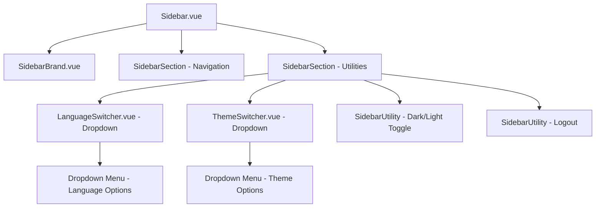

# Sidebar Navigation Components: Restore Language & Theme Switchers as Dropdowns

## Overview

This design restores the Language and Theme switchers from simple icon toggles back to **dropdown-based utilities**, fixes the **brand logo** so it never shifts horizontally, and keeps sidebar geometry consistent. The solution preserves the existing rules: one shared **icon axis**, **icon-only** utilities, and **hover/active** states implemented via **pseudo-elements** to avoid layout shifts.

**Constraints**

* No new packages; only `npm i` and `npm run dev`.
* Utilities remain icon-only (no visible labels).
* Dropdowns must not affect layout; absolute-positioned overlays only.

## Technology Stack & Dependencies

* **Frontend Framework**: Vue 3.4.21 with Composition API
* **Build Tool**: Vite 5.2.8
* **Styling**: Tailwind CSS 3.4.3 + CSS Custom Properties
* **Icons**: Material Icons (outlined/regular)
* **State Management**: Custom stores (`langStore`, `themeStore`)
* **Routing**: Vue Router 4.3.0

> If versions differ in the repo, keep the approach identical; no version-specific features are required.

## Architecture

### Component Hierarchy



### Geometry System

Shared CSS custom properties ensure consistent alignment:

* **Collapsed Width**: 72px
* **Expanded Width**: 256px
* **Icon Axis**: 36px (collapsed width / 2)
* **Icon Size**: 24px
* **Left Gutter**: 24px (icon axis − icon size / 2)
* **Row Height**: 48px

> All rows (brand, router items, utilities) use a two-track grid: **\[icon fixed 24px] + \[label flexible]** with `padding-left: var(--left-gutter)` so icons sit exactly on the axis. Labels (router items only) animate width→0 on collapse; the icon track never changes.

## Component Specifications

### 1. Language Switcher Component (LanguageSwitcher.vue)

#### Trigger Button

* **Icon**: `language` (Material Icons outlined)
* **Geometry**: Circular hit area (40–48px), centered on the shared icon axis
* **Hover**: Circular overlay via `::before` pseudo-element (no layout change)
* **A11y**: `title="Language"`, `aria-label="Language"`, `aria-haspopup="menu"`, `:aria-expanded="isOpen ? 'true' : 'false'"`

#### Dropdown Menu

* **Placement**: `position: absolute; bottom: 0; left: 100%; margin-left: 8px`
* **Size/Style**: width 128px; padding 8px; `rounded-xl`; background `var(--c-bg-secondary)`; border `var(--c-border)`; `shadow-lg`; `z-index: 50`
* **Behavior**: Positioned relative to the trigger container (ensure the trigger wrapper is `position: relative` and the sidebar does **not** clip overflow)
* **Close Triggers**: outside click, **Escape**, selection, and route change (to avoid a stale open state)

#### Menu Options

* **English** (`langStore.current === 'en'`)
* **Русский** (`langStore.current === 'ru'`)
* **Item Styles**:
  Default `var(--c-text-primary)` → Hover `var(--c-bg-hover)` + `var(--c-text-accent)` → Active `var(--c-text-brand)`

#### Animation

* **Enter**: 100ms ease-out (`scale 0.95→1`, `opacity 0→1`)
* **Leave**: 75ms ease-in (`scale 1→0.95`, `opacity 1→0`)
* Respect `prefers-reduced-motion`: fade-only fallback

#### State

* Single source of truth: **`langStore`**. No duplicated local state beyond `isOpen`.
* After selection, close the menu and update `langStore` (persist as it does today).

### 2. Theme Switcher Component (ThemeSwitcher.vue)

#### Trigger Button

* **Icon**: `palette` (Material Icons outlined)
* **Geometry/Hover/A11y**: Same as Language switcher (`title="Theme"`, `aria-label="Theme"`)

#### Dropdown Menu

* Same placement, sizing, and animation as Language switcher

#### Options & State

* Options: **Classic**, **Sapphire** (only)
* **Active** when `<html data-theme="...">` matches
* On select: set `data-theme` on `<html>`, persist to `localStorage['app:theme']`, close the menu
* On mount: read from `data-theme` / storage; default to `'classic'` if invalid

> The **Light/Dark** mode remains a **separate icon-only toggle** (sun↔moon), not part of this dropdown.

### 3. Brand Logo Component (SidebarBrand.vue)

#### Fixed Positioning Strategy

```css
.sidebar-brand {
  display: grid;
  grid-template-columns: var(--icon-size) 1fr; /* [Icon] + [Label track] */
  padding-left: var(--left-gutter);            /* align icon on axis */
  align-items: center;
  position: relative; /* for any subtle effects if needed */
}

.brand-icon {
  width: var(--icon-size);
  height: var(--icon-size);
  display: grid;
  place-items: center;
  /* No transforms or negative margins */
}

/* Wordmark remains hidden for now (label track can stay at width: 0) */
```

#### Behavior

* **Collapsed**: clicking the logo **expands** the sidebar (no navigation)
* **Expanded**: clicking the logo **navigates** to Dashboard
* **Hover**: subtle micro-effect on the logo only (e.g., slight color/opacity lift); **no** pill/circle row background

#### Fixed X Position

* The logo’s icon **must not move** horizontally between states (identical axis as other icons)
* Keep the label track present (width `0`) so grid geometry stays stable

### 4. Sidebar Utility Integration

#### Utilities Source

Render utilities from **one** array (no duplicates), in this order:

1. Language (dropdown)
2. Theme (dropdown)
3. Light/Dark (icon toggle)
4. Logout (icon button)

#### Component Support

`SidebarUtility` must handle:

* **Slotted utilities** (Language/Theme switchers render themselves)
* **Icon utilities** (Light/Dark, Logout) via props

```html
<SidebarUtility v-if="utility.slot">
  <component :is="utility.component" />
</SidebarUtility>
<SidebarUtility
  v-else
  :icon="utility.icon"
  :aria-label="utility.ariaLabel"
  :title="utility.title"
  @click="utility.action"
/>
```

> All utilities share the same circular hover overlay (pseudo-element) and are centered on the icon axis. No visible labels.

## State Management Architecture

### Language Store Integration

* `LanguageSwitcher` calls `langStore.setLang(lang)`.
* Store persists to localStorage (existing behavior) and triggers reactivity.

### Theme Integration

* `ThemeSwitcher` writes `<html data-theme="...">` and persists to `localStorage['app:theme']`.
* CSS variables apply instantly without flicker.

## CSS Architecture & Hover States

### Shared Geometry Tokens

```css
.sidebar {
  --collapsed-width: 72px;
  --expanded-width: 256px;
  --icon-size: 24px;
  --icon-axis-x: calc(var(--collapsed-width) / 2);             /* 36px */
  --left-gutter: calc(var(--icon-axis-x) - var(--icon-size)/2);/* 24px */
  --row-height: 48px;
  --row-radius: 12px;
  --hover-bg: var(--c-bg-hover);
  --focus-ring: color-mix(in oklab, var(--accent) 60%, transparent);
}
```

### Circular Hover (Utilities & Collapsed Items)

```css
.sidebar-utility,
.sidebar.collapsed .sidebar-item { position: relative; }

.sidebar-utility::before,
.sidebar.collapsed .sidebar-item::before {
  content: "";
  position: absolute;
  left: var(--icon-axis-x); top: 50%;
  translate: -50% -50%;
  width: var(--row-height); height: var(--row-height);
  border-radius: 50%;
  background: var(--hover-bg);
  opacity: 0;
  transition: opacity 200ms ease;
  pointer-events: none;
}

.sidebar-utility:hover::before,
.sidebar.collapsed .sidebar-item:hover::before,
.sidebar-utility[aria-current="page"]::before,
.sidebar.collapsed .sidebar-item[aria-current="page"]::before {
  opacity: 1;
}
```

### Dropdown Positioning (no layout shift)

```css
.dropdown-menu {
  position: absolute;
  bottom: 0;
  left: 100%;
  margin-left: 8px;
  width: 128px;
  padding: 8px;
  border-radius: 12px;
  background-color: var(--c-bg-secondary);
  border: 1px solid var(--c-border);
  box-shadow: 0 10px 15px -3px rgba(0,0,0,.1);
  z-index: 50;
}
```

> Ensure the **trigger wrapper** is `position: relative` and the sidebar container does **not** clip the menu (`overflow: visible` or appropriate stacking context). Use `stopPropagation` inside the menu so outside-click logic doesn’t immediately close it.

## Accessibility Features

### Keyboard Navigation

* **Tab** to focus triggers and menu items; **Enter/Space** to activate
* **Escape** closes an open dropdown and **returns focus** to the trigger
* **Arrow keys** navigate within the open dropdown (optional but recommended)

### Screen Reader Support

```html
<button
  aria-haspopup="menu"
  :aria-expanded="isOpen ? 'true' : 'false'"
  :aria-label="titleText"
  :title="titleText">
```

* Menu container uses `role="menu"`; options use `role="menuitem"`
* Utilities (icon-only) always expose `title` and `aria-label`

### Focus Management

* Focus trap within an open menu (first/last item loop)
* Circular **focus ring** that matches hover geometry (pseudo-element), visible on dark themes

## Animation Specifications

### Dropdown Transitions

```css
.dropdown-enter-active { transition: all 100ms ease-out; }
.dropdown-enter-from    { transform: scale(.95); opacity: 0; }
.dropdown-enter-to      { transform: scale(1);   opacity: 1; }

.dropdown-leave-active { transition: all 75ms ease-in; }
.dropdown-leave-from   { transform: scale(1);   opacity: 1; }
.dropdown-leave-to     { transform: scale(.95); opacity: 0; }
```

### Reduced Motion

```css
@media (prefers-reduced-motion: reduce) {
  .dropdown-enter-active,
  .dropdown-leave-active { transition: opacity 120ms ease; }
  .dropdown-enter-from,
  .dropdown-leave-to { transform: none; }
}
```

> Existing sidebar text fade rules remain unchanged; if label fades are present elsewhere, keep the **right-edge** mask only during collapse (no static left fade).

## Implementation Requirements

### File Modifications

1. **Sidebar.vue** — Utilities section supports slotted components; ensure overflow doesn’t clip dropdowns.
2. **SidebarUtility.vue** — Add slot support; keep circular hover overlay via pseudo-element.
3. **LanguageSwitcher.vue** — Implement icon trigger + dropdown as specified; integrate `langStore`.
4. **ThemeSwitcher.vue** — Implement icon trigger + dropdown; write `<html data-theme>` and persist.
5. **SidebarBrand.vue** — Use two-track grid with left gutter; pin logo X; keep wordmark hidden.

### Integration Pattern

```html
<SidebarSection class="sidebar__utilities">
  <template v-for="u in utilities" :key="u.id">
    <SidebarUtility v-if="u.slot"><component :is="u.component" /></SidebarUtility>
    <SidebarUtility v-else
      :icon="u.icon"
      :aria-label="u.ariaLabel"
      :title="u.title"
      @click="u.action" />
  </template>
</SidebarSection>
```

## Validation Criteria

* ✅ Language and Theme switchers are dropdowns that open to the right with correct styling/animation.
* ✅ Brand logo maintains a fixed horizontal position across collapse/expand.
* ✅ Utilities are icon-only and appear exactly once each; hover is a circular overlay (no stretch).
* ✅ Dropdowns do not shift layout and close on outside click, Escape, selection, and route change.
* ✅ Theme persists to `localStorage['app:theme']` and applies via `<html data-theme>`; Language updates via `langStore`.
* ✅ Keyboard and screen reader support as described; focus rings match geometry.
* ✅ No new dependencies; project runs via `npm run dev`.
