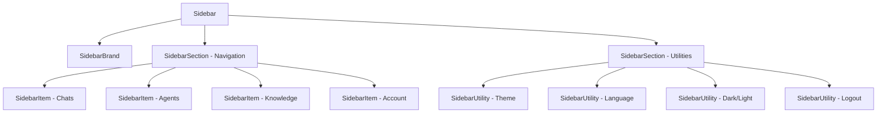

# Sidebar UX Component Design

## Overview

This document specifies the design for a complete rewrite of the sidebar navigation component to meet strict UX requirements focused on consistent icon positioning, proper hover geometries, and smooth animations. The redesign emphasizes a shared icon axis that never shifts horizontally, distinctive hover shapes for different component types, and intelligent brand behavior that changes based on sidebar state.

**Constraints**

* Icons are **always visible** (brand, router menu, utilities).
* **Labels exist only for router-menu items** and **hide on collapse**.
* **Allowed commands only:** `npm i`, `npm run dev`. No other CLI steps or new dependencies.

## Technology Stack & Dependencies

**Framework & Libraries:**

* Vue 3 Composition API with `<script setup>`
* Vue Router for navigation
* Tailwind CSS for utility-first styling
* Material Icons for iconography
* CSS custom properties for theming

**State Management:**

* Local reactive state with `ref()` for sidebar collapse
* `localStorage` persistence for user preferences
* Integration with existing stores (`themeStore`, `langStore`)

**Key Dependencies:**

```javascript
// Core Vue composables
import { ref, computed, onMounted } from 'vue'
import { useRoute, useRouter } from 'vue-router'

// Store integrations
import { themeStore } from '@/stores/ThemingStore.js'
import { langStore } from '@/stores/langStore.js'

// Utility components
import ThemeSwitcher from '@/components/ThemeSwitcher.vue'
import LanguageSwitcher from '@/components/LanguageSwitcher.vue'
```

## Component Architecture

### Component Hierarchy



### Component Definitions

#### Sidebar (Root Component)

**Responsibilities:**

* Manages global `collapsed` state
* Provides CSS custom properties for shared geometry (scoped to `.sidebar`)
* Handles state persistence via `localStorage`
* Orchestrates layout structure and state flags for animations

**Key Properties:**

```javascript
const collapsed  = ref(false)   // UI state
const animating  = ref(false)   // true while transition runs
const collapsing = ref(false)   // true only during collapse animation
```

**CSS Custom Properties (scoped to `.sidebar`):**

```css
.sidebar {
  --collapsed-width: 72px;
  --expanded-width: 256px;
  --icon-size: 24px;
  --icon-axis-x: calc(var(--collapsed-width) / 2); /* 36px */
  --left-gutter: calc(var(--icon-axis-x) - var(--icon-size) / 2); /* 24px */
  --row-height: 48px;
  --row-radius: 12px;
  --hover-pad: 8px;

  /* color tokens should map to your theme system */
  /* use existing tokens where possible (examples): */
  --sidebar-bg: var(--surface);
  --sidebar-border: color-mix(in oklab, var(--text) 8%, transparent);
  --hover-bg: color-mix(in oklab, var(--accent) 14%, transparent);
  --active-bg: color-mix(in oklab, var(--accent) 20%, transparent);
  --focus-ring: color-mix(in oklab, var(--accent) 60%, transparent);
}
```

#### SidebarBrand

**Dual Behavior Pattern:**

* **Collapsed:** click expands sidebar (no navigation)
* **Expanded:** click navigates to Dashboard

**Hover States:**

* **Collapsed:** subtle **logo-only** micro-effect (tiny halo/color lift), **no button background**
* **Expanded:** minimal **wordmark-only** effect (e.g., slight color lift), **no button background**

**Template Structure:**

```vue
<div class="sidebar-brand" @click="handleBrandClick">
  <div class="brand-icon">
    
  </div>
  <div class="brand-label" v-if="!collapsed">
    Trickster
  </div>
</div>
```

#### SidebarSection

**Purpose:** Groups related items with consistent styling

**Types:**

* Navigation section (router items)
* Utilities section (bottom controls)

#### SidebarItem (Router Navigation)

**Features:**

* Icon + label (label hidden when collapsed)
* **Pill** hover/active/focus geometry when expanded
* **Circle** hover/active/focus geometry when collapsed
* Active state indication mirrors hover geometry
* Icons never move horizontally

**Grid Layout:**

```css
.sidebar-item {
  position: relative;
  display: grid;
  grid-template-columns: var(--icon-size) 1fr;
  column-gap: 12px;
  padding-left: var(--left-gutter);
  height: var(--row-height);
  align-items: center;
}
```

#### SidebarUtility (Bottom Controls)

**Characteristics:**

* **Icon-only** (no labels ever; both states)
* **Circular** hover/active/focus geometry (same as collapsed items)
* ARIA labels and `title` for accessibility/tooltips
* Integration with existing components (ThemeSwitcher, LanguageSwitcher)

### Component Communication Patterns

**Props Down:**

```javascript
// Sidebar → SidebarItem
defineProps({
  collapsed: Boolean,
  item: Object, // { key, to, icon }
  isActive: Boolean
})

// Sidebar → SidebarUtility
defineProps({
  collapsed: Boolean,
  icon: String,
  ariaLabel: String,
  onClick: Function
})
```

**Events Up:**

```javascript
// SidebarBrand → Sidebar
const emit = defineEmits(['expand', 'navigate'])

// SidebarItem uses Vue Router for navigation

// SidebarUtility → Sidebar
const emit = defineEmits(['action'])
```

## Geometry & Design Tokens

### Core Measurements

| Token               | Value | Purpose                                     |
| ------------------- | ----- | ------------------------------------------- |
| `--collapsed-width` | 72px  | Fixed width when sidebar is collapsed       |
| `--expanded-width`  | 256px | Width when sidebar is expanded              |
| `--icon-size`       | 24px  | Consistent icon dimensions                  |
| `--icon-axis-x`     | 36px  | Horizontal center for icon alignment        |
| `--left-gutter`     | 24px  | Left padding to center the icon on the axis |
| `--row-height`      | 48px  | Consistent height for all interactive rows  |
| `--row-radius`      | 12px  | Border radius for pill geometry             |

### Shared Icon Axis System

**Critical Requirement:** All icons align on a single vertical axis at `--icon-axis-x` (36px from left edge). The icon’s X **must not move** between expanded/collapsed.

**Implementation:**

```css
.sidebar-row {
  display: grid;
  grid-template-columns: var(--icon-size) 1fr;
  column-gap: 12px;
  padding-left: var(--left-gutter);
  height: var(--row-height);
  align-items: center;
}

.sidebar-icon {
  width: var(--icon-size);
  height: var(--icon-size);
  display: grid;
  place-items: center;
}
```

### Row Grid System

**Two-Track Layout:**

1. **Icon Track:** fixed 24px
2. **Label Track:** flexible; animates to width **0** when collapsed (keep in DOM to animate smoothly)

**Benefits:**

* Icons never move horizontally during collapse/expand
* Labels smoothly animate in/out with opacity mask on collapse
* Consistent alignment across all row types

## Behavior Specifications

### Brand Row Interaction

**State-Dependent Behavior:**

```mermaid
flowchart TD
    A[User Clicks Brand] --> B{Sidebar Collapsed?}
    B -->|Yes| C[Expand Sidebar (no navigation)]
    B -->|No| D[Navigate to Dashboard]
```

**Implementation Pattern:**

```javascript
const handleBrandClick = () => {
  if (collapsed.value) {
    collapsed.value = false   // expand only
    localStorage.setItem(STORAGE_KEY, 'false')
  } else {
    router.push('/')          // navigate to dashboard
  }
}
```

### Router Menu Behavior

**Hover Geometry by State:**

| State     | Geometry | Description                             |
| --------- | -------- | --------------------------------------- |
| Expanded  | Pill     | Rounded rectangle covering icon + label |
| Collapsed | Circle   | Perfect circle around icon only         |

**Active State Indication:**

* Mirrors hover geometry (pill in expanded, circle in collapsed)
* Uses theme tokens (`--active-bg`, `--accent`) for color/contrast

### Bottom Utilities Behavior

**Consistent Characteristics:**

* Always **icon-only**
* Always **circular** hover/active/focus
* Must include `aria-label` and `title`
* Integrate existing utility components without changing their logic

**Utility Mapping:**

```javascript
const utilities = [
  { component: 'ThemeSwitcher',   icon: 'palette',      ariaLabel: 'Switch theme' },
  { component: 'LanguageSwitcher',icon: 'language',     ariaLabel: 'Switch language' },
  {
    icon: computed(() => themeStore.isDarkMode ? 'dark_mode' : 'light_mode'),
    ariaLabel: computed(() => themeStore.isDarkMode ? 'Switch to light mode' : 'Switch to dark mode'),
    onClick: () => themeStore.toggleDarkMode()
  },
  { icon: 'logout', ariaLabel: 'Logout', onClick: handleLogout }
]
```

### Collapse Control

**Visibility Rules:**

* **Expanded:** chevron/toggle is visible in header
* **Collapsed:** no chevron; expansion is via **brand click**

```vue
<button
  v-if="!collapsed"
  @click="toggle"
  class="collapse-toggle"
  :aria-expanded="(!collapsed).toString()"
>
  <span class="material-icons">chevron_left</span>
</button>
```

## Transitions & Animations

### Animation Strategy

**Core Principle:** Animate only **label width** and **opacity** to avoid layout thrash and jank.

**Transition Specs:**

* **Duration:** 180–220ms
* **Easing:** `ease`
* **Properties:** `width`, `opacity` (labels); **icon track and paddings never animate**

### Text Fade Implementation

**Collapse Animation (right-edge fade):**

```css
.sidebar-label {
  transition: width 200ms ease, opacity 200ms ease;
  overflow: hidden;
  white-space: nowrap;
}

/* apply only while collapsing; fade out the RIGHT edge */
.sidebar.collapsing .sidebar-label {
  mask-image: linear-gradient(to right, black calc(100% - 16px), transparent 100%);
  -webkit-mask-image: linear-gradient(to right, black calc(100% - 16px), transparent 100%);
}
```

**Expand Animation:**

```css
/* no mask; labels appear cleanly */
.sidebar-label { mask-image: none; -webkit-mask-image: none; }
```

### Hover Geometry (no layout shift)

Use **pseudo-elements** for hover/active/focus backgrounds so geometry does not alter layout.

**Pill (Expanded Router Items):**

```css
.sidebar:not(.collapsed) .sidebar-item {
  position: relative;
}
.sidebar:not(.collapsed) .sidebar-item::before {
  content: "";
  position: absolute;
  inset: 0;
  border-radius: var(--row-radius);
  background: var(--hover-bg);
  opacity: 0;
  transition: opacity 200ms ease;
  pointer-events: none;
}
.sidebar:not(.collapsed) .sidebar-item:hover::before,
.sidebar:not(.collapsed) .sidebar-item[aria-current="page"]::before {
  opacity: 1;
}
```

**Circle (Collapsed & Utilities):**

```css
/* item container keeps its grid size; circle is an overlay */
.sidebar.collapsed .sidebar-item,
.sidebar-utility {
  position: relative;
}

.sidebar.collapsed .sidebar-item::before,
.sidebar-utility::before {
  content: "";
  position: absolute;
  left: var(--icon-axis-x);
  top: 50%;
  translate: -50% -50%;
  width: var(--row-height);
  height: var(--row-height);
  border-radius: 50%;
  background: var(--hover-bg);
  opacity: 0;
  transition: opacity 200ms ease;
  pointer-events: none;
}

.sidebar.collapsed .sidebar-item:hover::before,
.sidebar.collapsed .sidebar-item[aria-current="page"]::before,
.sidebar-utility:hover::before,
.sidebar-utility[aria-current="page"]::before {
  opacity: 1;
}
```

### Focus Rings (shape-aware)

Match focus geometry with a separate pseudo-element to avoid rectangular outlines around circles.

```css
/* pill focus */
.sidebar:not(.collapsed) .sidebar-item:focus-visible::after {
  content: "";
  position: absolute;
  inset: 0;
  border-radius: var(--row-radius);
  outline: 2px solid var(--focus-ring);
  outline-offset: 2px;
}

/* circle focus */
.sidebar.collapsed .sidebar-item:focus-visible::after,
.sidebar-utility:focus-visible::after {
  content: "";
  position: absolute;
  left: var(--icon-axis-x);
  top: 50%;
  translate: -50% -50%;
  width: var(--row-height);
  height: var(--row-height);
  border-radius: 50%;
  outline: 2px solid var(--focus-ring);
  outline-offset: 2px;
}
```

### Performance Considerations

* Avoid animating geometric layout on the icon track; animate label width/opacity only.
* Pseudo-element overlays prevent reflow on hover/active/focus.
* Respect reduced-motion preferences:

```css
@media (prefers-reduced-motion: reduce) {
  .sidebar-label,
  .sidebar-item::before,
  .sidebar-item::after,
  .sidebar-utility::before,
  .sidebar-utility::after {
    transition: opacity 120ms ease;
  }
}
```

## Visual Design Details

### Theme Integration

Use existing project tokens; avoid inventing new names where possible:

* Sidebar surfaces/border → `--surface`, `--ring` (or map to `--sidebar-bg`, `--sidebar-border`)
* Accent/active states → `--accent`, `--active-bg`
* Focus → `--focus-ring` (mapped from accent)

```css
.sidebar {
  background-color: var(--sidebar-bg);
  border-right: 1px solid var(--sidebar-border);
  color: var(--text);
}
```

## Accessibility Implementation

### Keyboard Navigation

* Standard Tab order is sufficient. (Arrow-key roving tabindex is **not required**.)
* Enter/Space activate items.
* Hit target per row ≥ **44px** height.

### Screen Reader Support

* Navigation landmark:

```vue
<nav aria-label="Primary navigation">
```

* Utilities (icon-only) must include `aria-label` and `title`:

```vue
<button :aria-label="ariaLabel" :title="ariaLabel">
```

* Collapsed router items may optionally show `title` for quick tooltips.

### Focus Management

* Focus indicators must match geometry (pill/circle) and be clearly visible on dark surfaces.

## Technical Implementation

### State Management (unified toggle)

**Collapse State Persistence & Animation Flags (single source of truth):**

```javascript
const STORAGE_KEY = 'sidebar:collapsed'

const collapsed  = ref(localStorage.getItem(STORAGE_KEY) === 'true')
const animating  = ref(false)
const collapsing = ref(false)

const toggle = () => {
  animating.value  = true
  collapsing.value = !collapsed.value // will be true if we are about to close

  collapsed.value = !collapsed.value
  localStorage.setItem(STORAGE_KEY, collapsed.value.toString())

  setTimeout(() => {
    animating.value  = false
    collapsing.value = false
  }, 220) // keep in sync with CSS duration
}
```

### Router Integration

**Active Route Detection:**

```javascript
const route = useRoute()
const isActiveRoute = (to) => route.path === to || route.path.startsWith(to + '/')
```

**Navigation Items Configuration:**

```javascript
const navItems = [
  { key: 'chats',     to: '/chats',     icon: 'chat' },
  { key: 'agents',    to: '/agents',    icon: 'psychology' },
  { key: 'knowledge', to: '/knowledge', icon: 'library_books' },
  { key: 'account',   to: '/account',   icon: 'account_circle' }
]
```

### Theme-Aware Logo System

**Dynamic Logo Selection:**

```javascript
const currentLogo = computed(() => {
  const themeId = document.documentElement.getAttribute('data-theme') || 'classic'
  const logoMap = {
    classic: '/src/assets/logos/logo-classic.svg',
    sapphire: '/src/assets/logos/logo-sapphire.svg'
  }
  return logoMap[themeId] || logoMap.classic
})
```

## Testing Strategy

### Unit Testing Approach

**Component Testing:**

```javascript
describe('Sidebar Component', () => {
  test('persists collapsed state to localStorage', async () => {
    const wrapper = mount(Sidebar)
    await wrapper.vm.toggle()
    expect(localStorage.getItem('sidebar:collapsed')).toBe('true')
  })
})
```

**Animation Flags (fake timers):**

```javascript
vi.useFakeTimers()
test('animation flags set and reset', async () => {
  const wrapper = mount(Sidebar)
  wrapper.vm.toggle()
  expect(wrapper.vm.animating).toBe(true)
  vi.advanceTimersByTime(230)
  expect(wrapper.vm.animating).toBe(false)
})
```

**Accessibility Testing:**

```javascript
test('utilities expose aria-labels', () => {
  const wrapper = mount(Sidebar)
  const utilButtons = wrapper.findAll('[aria-label]')
  expect(utilButtons.length).toBeGreaterThan(0)
})
```

### Integration Testing

**Router Navigation:**

```javascript
test('navigates to correct route on item click', async () => {
  const wrapper = mount(Sidebar, { global: { plugins: [router] } })
  await wrapper.find('[data-testid="nav-chats"]').trigger('click')
  expect(wrapper.vm.$route.path).toBe('/chats')
})
```

### Visual Regression Testing

**Key Scenarios:**

* Collapsed vs expanded
* Hover geometries (pill vs circle)
* Active route highlighting
* Theme switching
* Collapse animation (right-edge label fade)

## Rewrite Implementation Strategy

### Migration Approach

**Phase 1: Component Structure**

1. Create component files per hierarchy.
2. Implement basic grid layout and geometry variables on `.sidebar`.
3. Render brand, navigation, utilities with icon axis.

**Phase 2: Behavior Implementation**

1. Add collapse/expand logic with unified `toggle()`.
2. Implement brand click semantics (expand vs navigate).
3. Wire Vue Router active states.

**Phase 3: Visual Polish**

1. Add pseudo-element hover/active/focus (pill/circle).
2. Add collapse-only right-edge label fade.
3. Add accessibility (ARIA/title, focus rings).

**Phase 4: Integration & Testing**

1. Replace existing sidebar in the app shell.
2. Run unit/integration tests.
3. Verify routes and stores behavior unchanged.

### Preservation Requirements

**Must Preserve:**

* Existing route targets (`/chats`, `/agents`, `/knowledge`, `/account`)
* Menu item order and i18n keys
* Integration with `themeStore` and `langStore`
* `localStorage` persistence patterns

**Data Test IDs:**

* If none exist, add semantic `data-testid` on brand, each nav item, each utility, and the toggle.

### Risk Mitigation

**Compatibility Assurance:**

* Keep parent-facing props/events stable (or provide a mapping if changed).
* Maintain external class names if consumed elsewhere.
* Do not regress accessibility.

**Performance Considerations:**

* Pseudo-element overlays avoid layout recalculation on hover.
* Animate only label width/opacity; no icon track shifts.
* Keep durations short; respect reduced motion.
